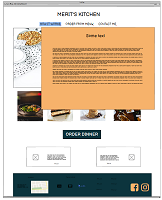

# Merit's kitchen

Milestone Project 2 - Interactive Frontend

The website is created with the purpose to advertise customers about Merit's home made restaurant.

## UX

### Mockup

![Merit's kitchen mockup] ()

The website has been made ...

As a custumer I want to see dishes and prices what Merit offers.

Website consists of 3 sections:

- **How it works**
- **Order from menu**
- **Contact me**

Wireframes are available here:

_
_ \*

## Features

### Existing Features

### How it works

### Order from menu

### Contact me

### Features left to implement

## Technologies Used

- HTML
- CSS
- JavaScript
- Bootstrap 4.5.2 (https://getbootstrap.com/)
  - Bootstrap was used as it was a convenient solution for several objects in my website.

## References

## Testing

### Fixed bugs

## Deployment

The website is hosted usign GitHub and deployed directly from the master branch.
All changes in website will be updated automatically once command 'git push' is runned.
In order to deploy website correctly on GitHub, the landing page must be named 'index.html'.

Live version of the website can be found under the link: (https://dinapapsujevica.github.io/MP1-Portfolio/).  
Source code on GitHub can be found under the link: (https://github.com/DinaPapsujevica/MP1-Portfolio.git).

## Credits

### Content

### Media

### Acknowledgements

Website is created for educational use!
