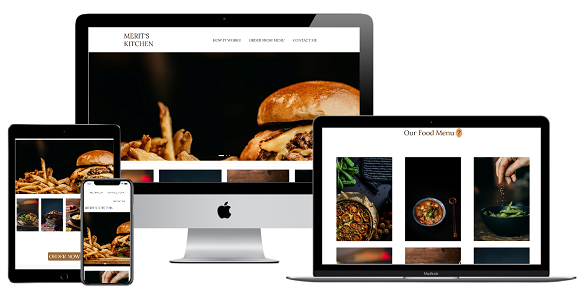
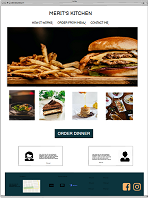
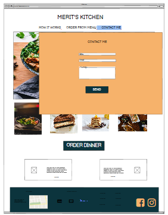
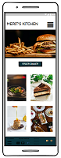

# Merit's kitchen

Milestone Project 2 - Interactive Front-end

The website is created with the purpose to advertise and inform community in Amager about Merits Thomsen small business - home made food service - Merit's kitchen.

## UX

### Mockup

As a customer I want to see the menu and prices of what Merit's kitchen offers. I want to see what the final product looks. Delicious food pictures help me to feel hungry and motivates me to order food for my dinner.

Website consists of 4 sections:

- **Landing page**
- **How it works**
- **Order from menu**
- **Contact me**

Wireframes are available here:

## Features

### Existing Features

Navbar on top helps user to navigate through the website. Logo in the left corner always brings the user back to the Landing page. On the medium and small sizes user can open navbar from the burger icon on the right top of the website.
Footer section follows through all sections and sizes. Footer section consists of contact information, social media links and option to subscribe for newsletters.

### Landing page

As a user you can see delicious food images to get the first impression that this website is about food.
Below you can see best sellers or seasonal dishes and welcoming button to make order. Pressing the Order Now the user is able to open the food menu section and make order.
Lower below i can read testimonials from other customers which, for a user, works as a good motivation to try this service too.

### How it works

As a user you can read information about Merit Thomsen, her idea behind this business and what is the service she is offering.

### Order from menu

As a user you are able to see food menu with delicious food images, information about the dishes and price.
In the bottom part of the page, user can fill in order information and proceed with order.

### Contact me

In this section user is able to contact Merit Thomsen, by filling the contact form.
User can see basic contact information and google map, which shows the business location.

### Features left to implement

- In Landing page I would like to add a sidebar with the latest news from Merit's kitchen. Like special offer, working hour changes or simply a place where Merit can interact with her customers.
- In the Footer section I would like to implement an option to receive customer email addresses, when they enter their email addresses and press subscribe for newsletters.
- I would like to link social media links to real Merit's kitchen profile. As the business is not real for now, links open general social media pages.
- In the Order from menu section I would like to implement an option to add discount code before the customer proceeds with payment. In case there is a special offer, customers use the code.
- In the food menu I would like to add an option to read about ingredients of the dish.

## Technologies Used

- HTML
- CSS
- JavaScript
- [Bootstrap 4.5.2](https://getbootstrap.com/)
- [jQuery](https://jquery.com/)
- [jQuery UI](https://jqueryui.com/)
- Google maps API
- [EmailJS](https://www.emailjs.com/)
- [PayPal Developer](https://developer.paypal.com/classic-home)

## References

- Code institute video projects
- [W3scools.com](https://www.w3schools.com/)
- [Stackoverflow](https://stackoverflow.com/)
- [CSS tricks](https://css-tricks.com)

## Testing

For testing code validity i used:

- [W3C Markup Validation](https://validator.w3.org/)
- [W3C CSS Validation](https://jigsaw.w3.org/css-validator/)
- [Jshint](https://jshint.com/)

During the tests the user story was achieved, advertising the business by providing the user with information about the business, product and price.

1. Landing page

Go to website https://dinapapsujevica.github.io/MP2-Merits-kitchen-/
Try to navigate through the navbar on top. All sections opens smoothly, emphasizing the active section with underline.
Logo in the left top corner always brings me back to landing page.
In medium and small sizes mobile navbar is available from the hamburger icon in the right top corner.
Try to hover over the smaller size images to see the name of the dish and price. These images are part of the food menu in the next section. Bigger carousel images working only as background images to give the total mood of the page.  
Try to press the big welcoming Order now button, which takes me directly to the Food menu section.
Testimonials slide in a slow carousel to give chance to read previous customer reviews.

2. How it works

Try to press How it works on navbar to open modal Merit's kitchen with extra information about the business owner Merit Thomsen and business idea itself.
The modal can close with a visible Close button in the right bottom corner of modal or clicking somewhere outside the modal.

3. Order from menu

Try to press the section on navbar Order from menu to open food menu page. Next to the headline there is an emphasized tooltip (questionmark) icon to inform me how to use menu below. Following the tooltip, I hover over the food image to read more about it, to see the price. The Add to Cart button let me add items to the shopping cart.
Below the food menu I can see Order Form where I can fill in to start my order, add food items and see total sum for my order. Try to press the Continue to checkout button to proceed with payment and open paypal or credit card payment option.

4. Contact me

Try to press the Contact me section to open the contact form and send a message to Merit's email. To send a message I need to fill all fields and after pressing Send Message, opens modal to inform me that message is sent.
I can also see contact info and location about the business. Location is shown in google maps and marked.

Social media links:

Try to press Social media icons in the footer of each section through the whole website.
Links will open in a new tab using target="\_blank". All links have been manually tested to ensure that they are linked to the right destination.

### Fixed bugs

- slicknav in medium and small sizes
- linking js in html
- implement informative modal in website
- responsive modal for all screen sizes

## Deployment

The website is hosted usign GitHub and deployed directly from the master branch.
All changes in website will be updated automatically once command 'git push' is runned.
In order to deploy website correctly on GitHub, the landing page must be named 'index.html'.

Live version of the website can be found under the link: (https://dinapapsujevica.github.io/MP2-Merits-kitchen-/).  
Source code on GitHub can be found under the link: (https://github.com/DinaPapsujevica/MP2-Merits-kitchen-.git).

## Credits

### Content

All the content on this website was written by me.

### Media

- Food images were taken from [Pexels](https://www.pexels.com/).

### Acknowledgements

- I received inspiration for this project from Code Institute project Rosie
- Code Institute student support
- Slack community
- I received a help in the middle of project from Romans Kackans
- For testing user experience I received help from Ieva Malta
- Big thanks for support to my mentor Spencer Barriball

Website is created for educational use!
